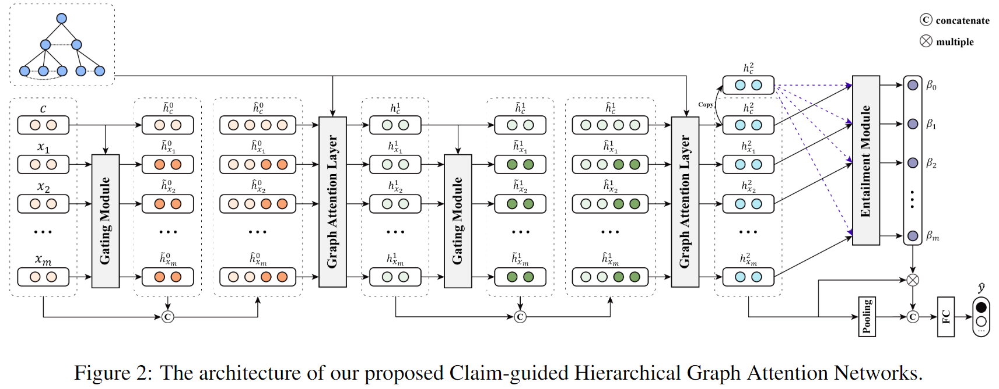

# Rumor Detection Project for STAT degree

Supervised Learning - Deep Learning - Graph Neural Networks - Rumor Detection

The dataset of this project is from Dr.Zubiaga's PHEME.

## Purpose

This project aims to build a deep learning network to identify whether tweets on online social media platforms are rumors or not.

The project is also declared to be reproduced from the paper ClaHi-GAT.

## Methodology

This project not only includes the structural information generated during rumor propagation, but also utilizes the textual information contained in the propagated tweets to improve the model performance of the rumor classification task. It also achieves better results in real-time rumor detection.

This project utilizes attention mechanisms and combines semantic information to assign weights between different propagation nodes in the graph structure to better obtain rumor propagation structure features and classification results.

## Attention

Data is too big to upload. If you need that please contact me. abnerzhang6@gmail.com